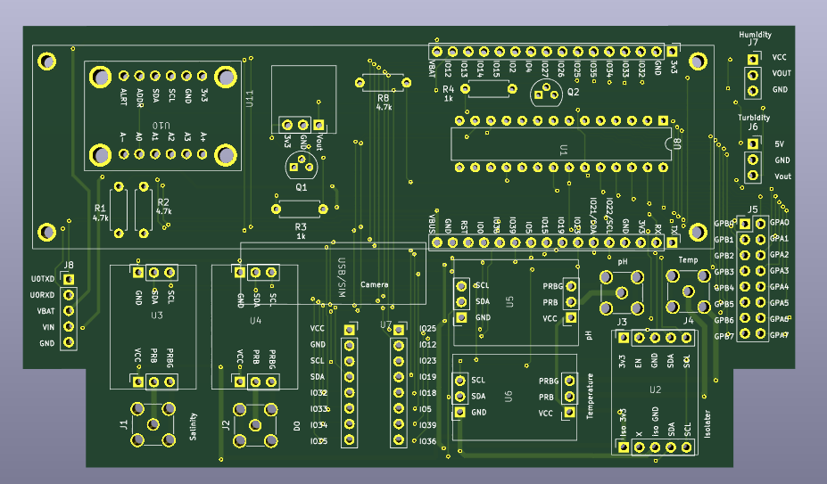

# Smart Sea Wall PCB Files
Repo for ESP32 Smart Sea Wall PCB and Hardware.  
***

## Table of Contents
- [Introduction](#introduction)
- [Getting Started](#getting-started)
- [Layout](#contains)
- [Bill of Materials](#bill-of-materials)
- [Installation](#installation)

***

## Introduction

We designed and created a PCB for easy recreation of the device. The sensors are plug and play, allowing the user to easily service the device. The file was desgined in KiCAD and printed using JLC PCB.

***

## Getting Started

 1. Gather all components stated in the [BOM](#bill-of-materials).
 2. Order the PCB through JLCPCB using the already created gerber zip file.
 3. Follow the soldering and installation instructions in the [Instalation](#installation) section.
 4. Test device with the embedded-code repository.

## Bill of Materials

As far as materials go, many you may not be able to find headers the exact size for what you need. In that case, just find the closest one to it and cut it down to size (e.g. cut a 6 pin header to 5 pins), or use multiple to make up the size you need.

 - (8) 3-pin header
 - (4) SMA male connector
 - (2) 16-pin header
 - (2) 8-pin header
 - (1) 5-pin header
 - (2) 8-pin terminals (2.54 pitch)
 - (2) 3-pin terminals (2.54 pitch)
 - (3) 4.7k resistors (7.62 horizontal length)
 - (2) 1k resistors (7.62 horizontal length)
 - (2) bjt transistors (2n2222 or similar)
 - (1) mcp23017 I2C IO extender - [link](https://www.digikey.com/en/products/detail/microchip-technology/MCP23017-E-SP/894272)
 - (1) Boost converter - [link](https://a.co/d/0dH0B8B)
 - (1) I2C ADC - [link](https://www.adafruit.com/product/1083)
 - (1) Lilygo ESP32 T-7000G - [link](https://lilygo.cc/products/t-sim7000g?srsltid=AfmBOoofkf4orIAGPrCQvzU6p47uRy_uEcURHfCpysc8IG0x-OTQUHQe)